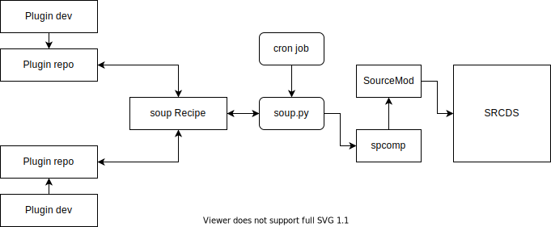

[](https://www.python.org/dev/peps/pep-0008/)
[](LICENSE)

# soup
CreamySoup/"Creamy SourceMod Updater" (or just **_soup_** for short), a helper script for automated SourceMod plugin updates management.

This project started as a custom utility for the Creamy Neotokyo servers (hence the name), but open sourcing and generalising it for any kind of SRCDS/SourceMod servers seemed like a good idea, in case it's helpful for someone else too.



## FAQ
### What it be?
**soup** is a Python 3 script, a SRCDS SourceMod plugin update helper, intended to be invoked periodically by an external cronjob-like automation system of one's choice.

It parses _soup recipes_, remote lists of resources to be kept up-to-date, compares those resources' contents to the target machine's local files, and re-downloads & re-compiles them if they differ. This will automatically keep such resources in-sync with their remote repository. For a SourceMod plugin, this means any new updates get automatically applied upon the next mapchange after the completion of a _soup_ update cycle.

The purpose of _soup_ is to reduce SRCDS sysop workload by making SourceMod plugin updates more automated, while also providing some granularity in terms of which plugins get updated when, with the introduction of aforementioned _recipes_ and the ability to maintain/curate them individually. For example, you could have some trusted _recipes_ auto-update their target plugins without any admin intervention, but choose to manually update more fragile or experimental plugins as required (or not at all).

### Which recipes to use?
You should always use the [default self-updater recipe](recipe_selfupdate.json) to keep the _soup_ script itself updated.

If you are operating a Neotokyo SRCDS, this project offers [some recommended recipe(s) here](https://github.com/CreamySoup/recipe-neotokyo). This resource is still work-in-progress, more curated lists to be added later!

You can also host your own custom _recipes_ as you like for any SRCDS+SourceMod server setup.

## Foreword of warning
While automation is nice, a malicious actor could use this updater to execute arbitrary code on the target machine. Be sure to only use updater source lists ("recipes") that you trust 100%, or maintain your own fork of such resources where you can review and control the updates.

This warning applies not only to the _recipe_ files themselves, but also to any remote resources that those _recipes_ may point to.

## Installation
It is recommended to use the [latest release](https://github.com/CreamySoup/soup/releases/latest), and [install with pip](https://pip.pypa.io/en/stable/cli/pip_install/), using the _requirements.txt_ file.

You should also consider using a [pipenv](https://github.com/pypa/pipenv) or [virtual environment](https://docs.python.org/3/library/venv.html) to isolate any Python dependencies from the rest of the system (although if you go this route, any cron job or similar automation should also run inside that env to have access to those deps).

Example (Linux):
```sh
whereis python # system Python install location

# Create a Python virtual environment
pip3 install --user --upgrade pipenv && pipenv --three

# Enter the virtual environment
pipenv --shell

whereis python # venv Python install location

# Install requirements from requirements.txt
pipenv install

# Run the script
python ./soup

# Exit virtual environment
exit
```

### Other requirements
* Python 3

## Config
Configuration can be edited in the [_config.yml_](config.yml) file that exists in OS specific config file location, or as defined by the `SOUP_CFG_DIR` environment variable.
Please see the additional comments within the config file for more information on the options.

### OS specific config file locations:
* Linux: `~/.config/soup/config.yml`
* Windows: `%LOCALAPPDATA%\soup\soup\config.yml`

### Recipes
The most powerful config option is `recipes`, which is a list of 0 or more URLs pointing to soup.py "recipes".

A **recipe** is defined as a valid JSON document using the following structure:
```json
{
  "section": [
    {
      "key": "value",
      <...>
    },
    <...>
  ],
  <...>
}
```

where

```json
<...>
```

indicates 0 or more additional repeated elements of the same type as above.

Note that trailing commas are not allowed in the JSON syntax – it's a good idea to validate the file before pushing any recipe updates online.

#### Recipe sections

There are three valid recipe sections: _updater_, _includes_, and _plugins_. Examples follow:

* **updater** – A self-updater section for the soup.py script contents. Only one section in total of this kind should exist at most in all of the recipes being used.

```json
	"updater": [
		{
			"version": "1.1.0",
			"url": "https://cdn.jsdelivr.net/gh/CreamySoup/soup@main/soup.py"
		}
	]
```

* **includes** – SourceMod include files that are required by some of the plugins in the recipes' _plugins_ section. Required file extension: .inc

```json
	"includes": [
		{
			"name": "neotokyo",
			"about": "sourcemod-nt-include - The de facto NT standard include.",
			"source_url": "https://cdn.jsdelivr.net/gh/CreamySoup/sourcemod-nt-include@master/scripting/include/neotokyo.inc"
		}
	]
```

* **plugins** – SourceMod plugins that are to be kept up to date with their remote source code repositories. Required file extension: .sp

```json
	"plugins": [
		{
			"name": "nt_srs_limiter",
			"about": "SRS rof limiter timed from time of shot, inspired by Rain's nt_quickswitchlimiter.",
			"source_url": "https://cdn.jsdelivr.net/gh/CreamySoup/nt-srs-limiter@master/scripting/nt_srs_limiter.sp"
		}
	]
```

For full examples of valid recipes, see the [self updater](recipe_selfupdate.json) in this repo, and the [Neotokyo recipe](https://github.com/CreamySoup/recipe-neotokyo) repository. By default, this repo is configured for game "NeotokyoSource", and to use these Neotokyo default recipes.

Recipe URLs are required to use the `https://` URI scheme, in other words plaintext HTTP connections are not allowed.

If the recipe remote assets reside inside GitHub or similar repository host, it's recommended to use a CDN instead of hotlinking the repo directly for better uptime and performance. For example, using [jsDelivr](https://github.com/jsdelivr/jsdelivr), the raw GitHub URL `https://raw.githubusercontent.com/CreamySoup/soup/main/recipe_selfupdate.json` would turn into `https://cdn.jsdelivr.net/gh/CreamySoup/soup@main/recipe_selfupdate.json`.

## Usage
The script can be run manually with `python soup.py`, but is recommended to be automated as a [cron job](https://en.wikipedia.org/wiki/Cron) or similar.

## For developers
Issue tickets and pull requests are welcome! If you would like to edit the Python script(s) in this project, note that they should remain [PEP 8](https://www.python.org/dev/peps/pep-0008/) compliant (tested using `pycodestyle`).
